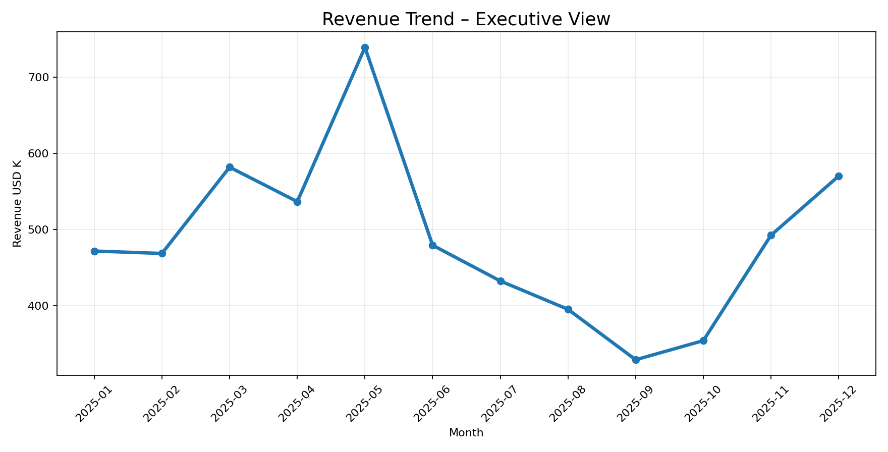
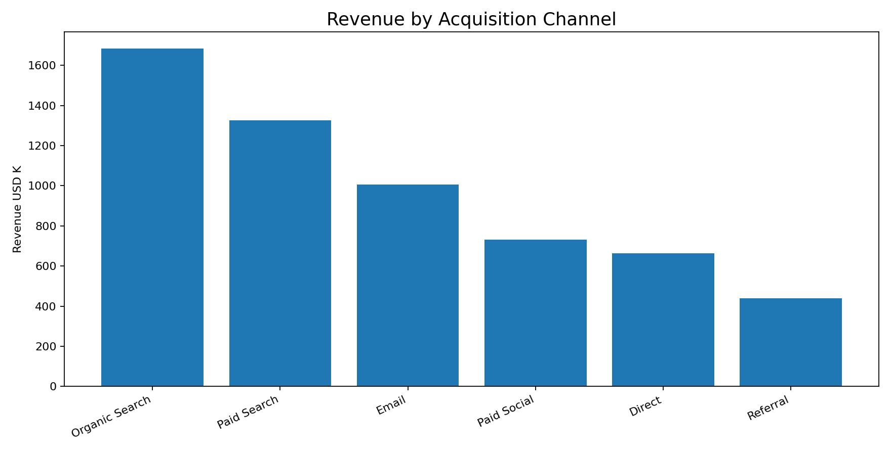
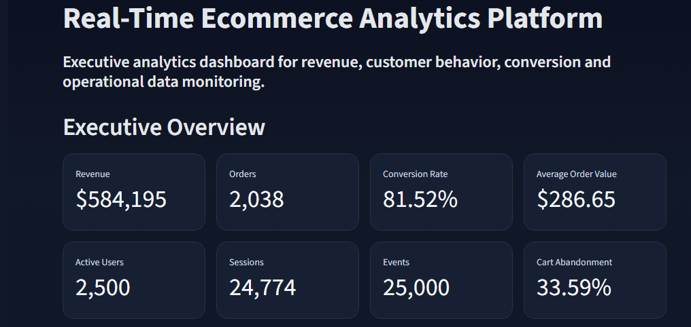

# Real-Time E-commerce BI Dashboard Upgrade

A professional Business Intelligence dashboard project for e-commerce analytics, designed for portfolio presentation, recruiter review and technical interviews.

This version adds a complete executive dashboard layer with interactive filters, realistic business KPIs, SQL logic and Looker Studio documentation.

## Dashboard Preview

### Revenue Trend


### Channel Performance



---

### Analytics & Revenue Monitoring


---

### Data Engineering & Operational Layer


---
## Live Dashboard Demo




---

## Dashboard Capabilities

- Executive KPI monitoring
- Revenue trend analysis
- Conversion funnel tracking
- Revenue by category
- Traffic source analysis
- Device performance monitoring
- Customer segmentation
- Interactive filtering
- Operational analytics visualization

---

## Core KPIs

## Business Context

Modern e-commerce teams need fast visibility into revenue, orders, conversion, marketing spend, customer acquisition cost and profitability.

This dashboard simulates a professional analytics environment where commercial, marketing and BI teams can monitor performance and identify business opportunities.

## Main KPIs


- Revenue
- Orders
- Sessions
- Conversion Rate
- Average Order Value
- Customer Acquisition Cost
- ROAS
- Gross Margin
- Profit
- Revenue by Channel
- Revenue by Category
- Revenue by Region
- Conversion by Device

## Interactive Dashboard Features

- Date range filter
- Channel filter
- Region filter
- Category filter
- Device filter
- Executive KPI cards
- Revenue trend
- Orders trend
- Conversion analysis
- CAC and ROAS analysis
- Channel performance table
- Category treemap
- Regional performance
- Downloadable filtered dataset

## Project Structure

```text
real_time_ecommerce_dashboard_upgrade/
│
├── dashboards/
│   └── streamlit/
│       └── app.py
│
├── data/
│   ├── raw/
│   │   └── ecommerce_orders_2025.csv
│   └── processed/
│       └── ecommerce_dashboard_dataset.csv
│
├── sql/
│   └── bigquery_dashboard_kpis.sql
│
├── docs/
│   └── looker_studio_dashboard_spec.md
│
├── assets/
│   ├── revenue_trend_preview.png
│   └── channel_performance_preview.png
│
├── requirements.txt
└── README.md
```

## How to Run Locally

Install dependencies:

```bash
pip install -r requirements.txt
```

Run the dashboard:

```bash
streamlit run dashboards/streamlit/app.py
```

## Looker Studio Version

A Looker Studio specification is included in:

```text
docs/looker_studio_dashboard_spec.md
```

It explains the filters, scorecards and charts needed to replicate the same BI dashboard in Looker Studio.

## SQL / BigQuery

The file below contains a BigQuery-style KPI query:

```text
sql/bigquery_dashboard_kpis.sql
```

## Interview Positioning

This project can be presented as:

> A professional e-commerce BI dashboard built to monitor revenue, conversion, marketing efficiency and commercial performance through interactive filters, SQL logic and executive KPIs.

## Author

Micaela Feriale  
Data Analytics | BI | SQL | Python | BigQuery  
LinkedIn: https://www.linkedin.com/in/micaelaferiale/