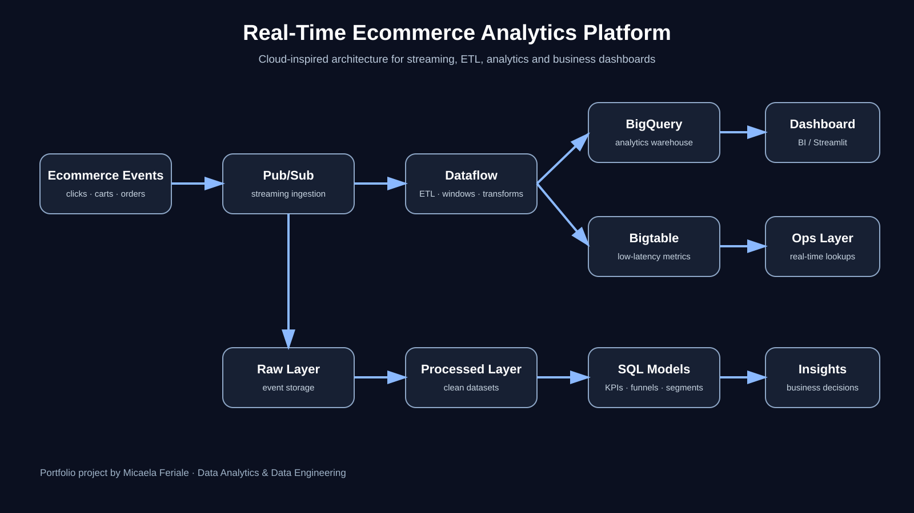
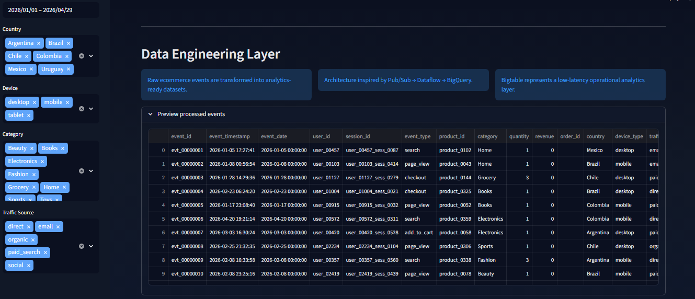
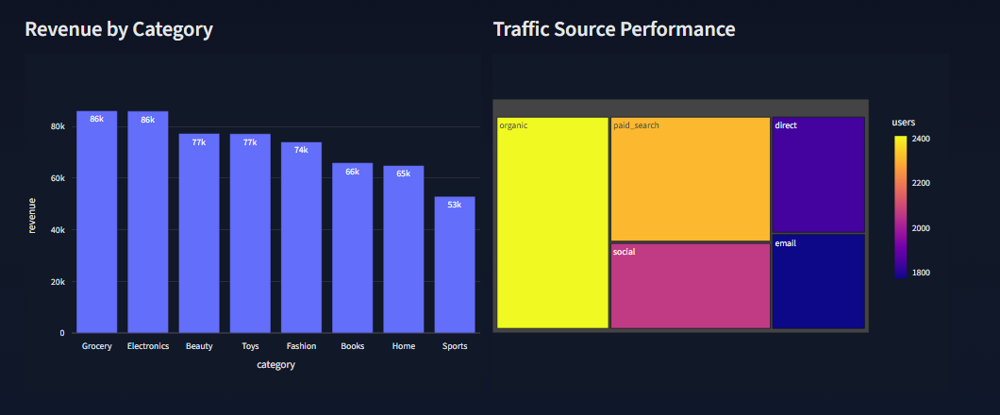
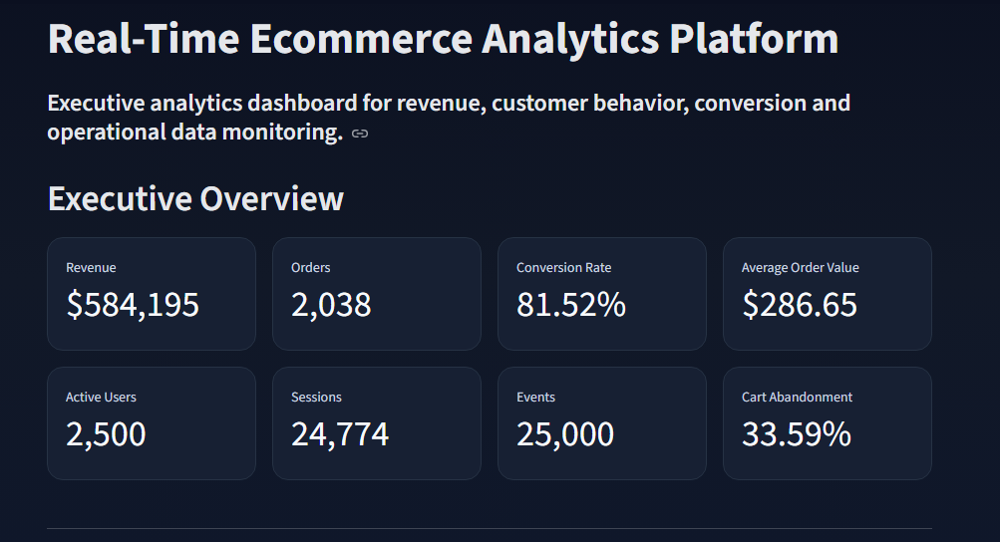

# Real-Time Ecommerce Analytics Platform




---

## Overview

A cloud-inspired ecommerce analytics platform designed to simulate modern data engineering and analytics workflows.

The project processes simulated ecommerce events, transforms raw operational data into analytics-ready datasets and exposes business KPIs through interactive dashboards.

It was built to demonstrate practical capabilities across:

- Data Engineering
- Analytics Engineering
- ETL/ELT Pipeline Design
- Data Modeling
- Streaming & Event-Driven Concepts
- Cloud Analytics Architecture
- Business Intelligence & KPI Development

---

## Business Context

Modern ecommerce platforms generate continuous streams of operational events including product views, searches, carts, checkouts and purchases.

Without a scalable analytics platform, organizations can face:

- Delayed reporting
- Inconsistent KPIs
- Limited visibility into customer behavior
- Poor funnel analysis
- Slow operational decision-making

This project addresses those challenges by transforming raw event data into structured business insights and executive-level dashboards.

---

## Architecture

Cloud-inspired architecture:

```text
Ecommerce Events → Pub/Sub → Dataflow → BigQuery → Dashboard
                                      → Bigtable
```

Local portfolio implementation:

```text
Simulated Events → Raw Data → Python ETL Pipeline → Processed Data → Streamlit Dashboard
```

---

## Technology Stack

| Area | Tools |
|---|---|
| Programming | Python |
| Data Processing | Pandas, NumPy |
| Analytics | SQL, BigQuery-style queries |
| Dashboard | Streamlit, Plotly |
| Cloud Concepts | Pub/Sub, Dataflow, BigQuery, Bigtable |
| Engineering Concepts | ETL/ELT, streaming, data modeling |

---

## Dashboard Preview

### Executive KPI Dashboard



---

### Analytics & Revenue Monitoring



---

### Data Engineering & Operational Layer



---

## Dashboard Capabilities

- Executive KPI monitoring
- Revenue trend analysis
- Conversion funnel tracking
- Revenue by category
- Traffic source analysis
- Device performance monitoring
- Customer segmentation
- Interactive filtering
- Operational analytics visualization

---

## Core KPIs

- Revenue
- Orders
- Conversion Rate
- Average Order Value
- Active Users
- Sessions
- Events
- Cart Abandonment Rate

---

## Repository Structure

```text
real-time-ecommerce-platform/
│
├── architecture/
│   ├── architecture.md
│   └── architecture_diagram.svg
│
├── dashboards/
│   └── streamlit/
│       └── app.py
│
├── data/
│   ├── raw/
│   └── processed/
│
├── docs/
│   ├── dashboard_documentation.md
│   └── linkedin_project_description.md
│
├── src/
│   ├── producer/
│   └── pipelines/
│
├── deployment/
├── assets/
├── requirements.txt
└── README.md
```

---

## Local Execution

Install dependencies:

```bash
pip install -r requirements.txt
```

Run ETL pipeline:

```bash
python src/pipelines/etl_pipeline.py
```

Run dashboard:

```bash
streamlit run dashboards/streamlit/app.py
```

---

## Engineering Concepts Demonstrated

- Event-driven architecture
- Streaming ingestion concepts
- ETL/ELT pipelines
- Data transformation workflows
- Analytics-ready modeling
- KPI layer design
- Dashboard-ready datasets
- Operational analytics concepts
- BigQuery-inspired analytical workflows

---

## Live Demo

Deploy the dashboard using Streamlit Cloud or Render to create a public interactive demo.

Main dashboard file:

```text
dashboards/streamlit/app.py
```

---

## Author

**Micaela Feriale**

Data Analytics | Data Engineering | SQL | Python | BigQuery | ETL | BI
